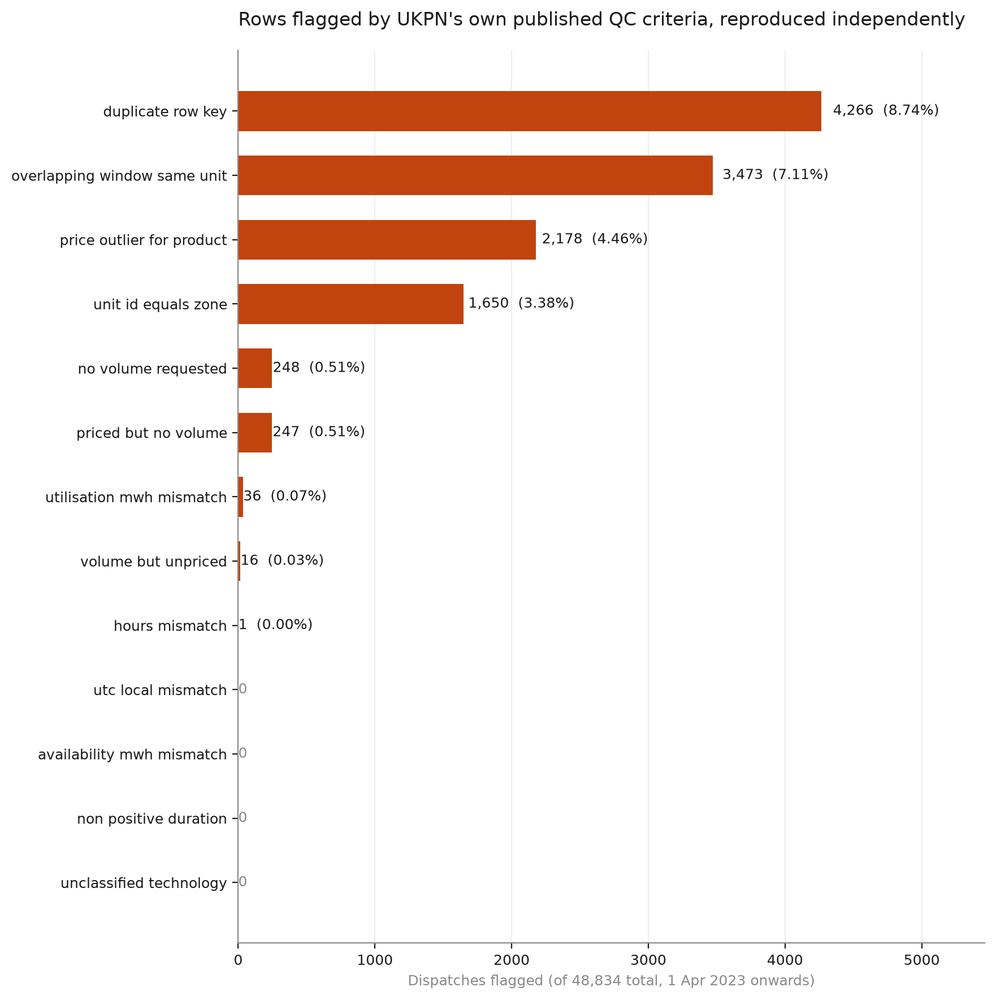

# Is distributed flexibility winning share in UKPN dispatches?

A short analysis of UK Power Networks' published flexibility dispatch data
(1 April 2023 onwards), asking two questions:

1. Is distributed flexibility — EV charge points, residential demand, heat pumps —
   taking share from grid-scale assets in DSO flexibility dispatches?
2. What is it paid per MWh relative to grid-scale, and does that differ by product
   and by zone?

Plus a validation layer that independently reproduces UKPN's own published
quality-control criteria, to understand the dataset properly before drawing
conclusions from it.


## Data quality

UKPN publish the checks their own QC algorithm applies: dispatch times consistent
with the contracted service window, correct flexibility zone, no duplicates, correct
contracted price and volume, and a matching active contract.

Three of those five need contract data that isn't in the public feed, so this repo
implements the internally-verifiable analogues alongside structural checks. **A flagged
row is a question, not a proven error.**




## An important caveat

This dataset reports **requested** volumes. UKPN state that requested volumes may not
match delivered volumes, depending on performance against the relevant baseline, and
that outturn is published separately in the annual Flexibility Report and data
appendices at Tender Hub.

Every MWh and £ figure here is therefore instructed, not settled. That gap — between
what was asked for and what was measured against a baseline and paid — is the
interesting problem, and reconciling the two sources is the obvious next step.

## Method

```
extract   pull the full history via the Opendatasoft /exports endpoint
transform resolve columns, parse timestamps, derive settlement periods, group technology
validate  reproduce UKPN's published QC criteria; produce an exceptions table
analyse   share over time, volume-weighted price, zone concentration, dispatch route
figures   publication charts
```

Two decisions worth flagging:

**Settlement periods are computed from local midnight**, not from a fixed 48-per-day
assumption. That makes 31 March come out at 46 periods and 27 October at 50, which is
the case most half-hourly pipelines quietly get wrong. There are tests for both.

**Prices are volume-weighted, not averaged.** A simple mean is dominated by
high-frequency small dispatches and understates what large units are actually paid.

## Running it

```bash
uv venv && source .venv/bin/activate
uv pip install -e ".[dev]"

# 1. Look at the real schema before trusting any column mapping
python scripts/discover_schema.py

# 2. Full run
python -m ukpn.pipeline

# 3. Tests
pytest

# 4. Explore
streamlit run app.py
```

Or:

```bash
docker build -t ukpn-flex . && docker run -p 8501:8501 ukpn-flex
```

If the portal requires a login for this dataset, set `UKPN_API_KEY` in your
environment. Nothing is committed.

## Notes

UKPN publish an official Python client (`ukpyn`). This repo hand-rolls a small client
instead, so that the offset ceiling on `/records`, the `/exports` route for full pulls,
retry behaviour and auth are visible and testable rather than hidden behind a
dependency. For production use, `ukpyn` is the sensible choice.

Data © UK Power Networks, published under their open data terms.
